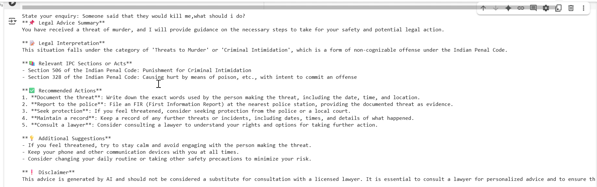

## Crime Law Chatbot using Generative AI (LLMs)

This project is a **Generative AI-powered chatbot** that acts as a legal assistant. It helps users understand Indian criminal law by responding to natural language questions with accurate IPC sections and clear legal advice.

---

## Screenshot

> A sample conversation using the chatbot inside a Jupyter Notebook.

---

## Features

- 📘 Identifies relevant **IPC sections** from user queries
- 🧠 Responds in simplified legal terms for all audiences
- ⚖️ Helpful for students, advisors, or common citizens
- ⚡ Powered by **LLaMA-based LLMs** via **Groq API** for high-speed performance

---

## Gen AI Concepts Used

### 1. Large Language Models (LLMs)
- Uses **LLaMA-based models** (like LLaMA2) for language understanding and legal reasoning.
- Accessed via **Groq's low-latency API infrastructure**.

### 2. Prompt Engineering
- Carefully designed system prompt instructs the model to act like a criminal law expert.
- Ensures answers:
  - Are legally relevant
  - Mention IPC sections where applicable
  - Use simple and clear language

### 3. API-based Model Inference
- Groq API is used to query LLaMA models hosted in the cloud.
- No local GPU or model hosting needed.

---

##  Warning: API Keys

🚨 **IMPORTANT SECURITY NOTE**:

This project uses a **Groq API Key**.

- Never expose your key in public code repositories.
- Use secure methods like `.env` files or GitHub Secrets.
- Add `.env` to `.gitignore` to prevent accidental leaks.

---

## Future Enhancements
-Add UI using Streamlit or Gradio
-IPC/CrPC database linking for fast legal lookup
-Multilingual support (Tamil, Hindi, etc.)
-Retrieval-Augmented Generation (RAG) for legal PDFs
-Option to switch between LLaMA models dynamically
-Legal case summarizer and real-time court examples

## License
This project is licensed under the MIT License.
You are free to use, modify, and distribute this project with attribution to the author. Refer to the LICENSE file for full terms.

## ✍️ Author
Shanmuga Priya S
Built with ❤️ for accessible legal tech using AI.

